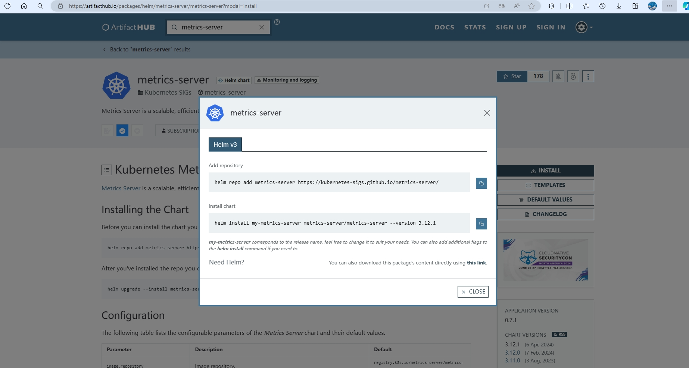

# ✈️ metrics-server

## 准备环境

* [x] docker
* [x] minikube
* [x] helm

## 下载chart安装包

[https://artifacthub.io/packages/helm/metrics-server/metrics-server](https://artifacthub.io/packages/helm/metrics-server/metrics-server)

<figure><figcaption></figcaption></figure>

按照提示执行

```
// 添加仓库
helm repo add metrics-server https://kubernetes-sigs.github.io/metrics-server/
```

```
// 执行安装，可能需要更新仓库
helm install metrics-server metrics-server/metrics-server --version 3.12.1 -n metrics-server
```

## 镜像无法拉取问题

下载tgz包，修改values镜像部分域名修改为 repository: k8s.mirror.nju.edu.cn，其他不变

```
image:
  repository: k8s.mirror.nju.edu.cn/metrics-server/metrics-server
```

## 报告tls错误问题

```
// 添加最后一行，忽略tls
defaultArgs:
  - --cert-dir=/tmp
  - --kubelet-preferred-address-types=InternalIP,ExternalIP,Hostname
  - --kubelet-use-node-status-port
  - --metric-resolution=15s
  - --kubelet-insecure-tls
```

## 检查是否成功

出现可视化图表即为成功

<figure><figcaption></figcaption></figure>
